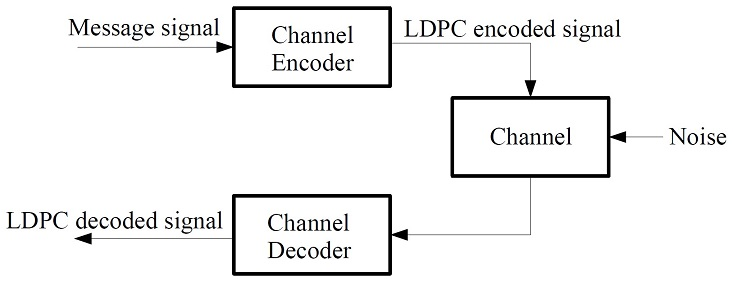
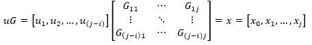
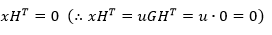
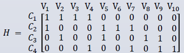
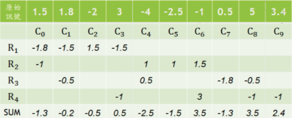
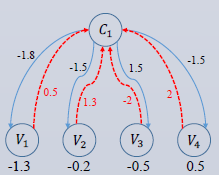
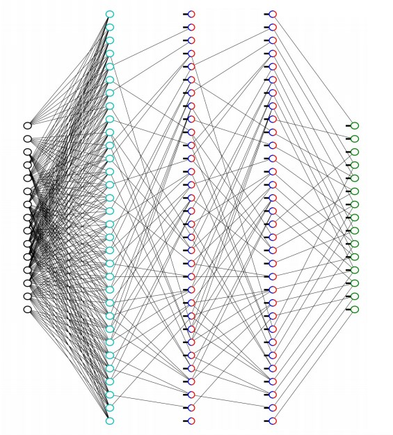
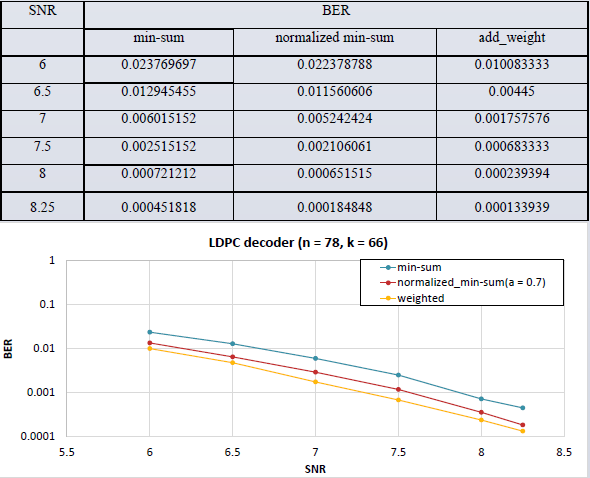

# LDPC Decoding using Neural Network
## Abstract
　With the development of machine learning and deep learning in recent years, applications have become more extensive, and even the field of communications has been greatly affected. In the process of communication, errors often occur due to noise interference. Therefore, in this topic, we combine machine learning and low-density parity check codes, and use machine learning to try to reduce decoding errors.  
　The method used in this topic is Belief propagation, also known as sum-product message passing. The algorithm we chose is the min-sum algorithm and use machine learning trains each signal's own weight. After comparing with the original method (fixed weight), it can reduce the error effectively after machine learning.
## System Structure

## LDPC Encoder
We multiply the message *u* we're going to send with matrix *G* and get a encoded message *x*.  
  
The length of original message is *(j - i)* bits, after multiplication with *G*, we get a *j* bits encoded message. The relationship of *x* and *G* is
  
Then we transform the orginal 010101 message by changing "0" to "+1" and "1" to "-1" in order to decode convieniently.
### LDPC Decoder
Use an example to tell how iteration works, below is a matrix *H*
  
Suppose the orignal V1 ~ V10 signal are [1.5, 1.8, -2, 3, -4, -2.5, -1, 0.5, 5, 3.4] respectively.  
Below we focus on Check Node C1.
1. Find the minimum: Find the minimum of the absolute value of all Variable Nodes that connected with C1 except itself.
2. Determine the sign: In all Variable Nodes connected with C1, multiply all Variable Nodes except itself to determine the sign. If the result is positive, then the final sign is positve, and vice versa.
3. Update Variable Node: After all Check Nodes complete the above two process, we can get the following table.  
  
Add the Variable Node's value with all value found on itself (*R#*), then we complete this process.
4. Update Check Node: Subtract the value we get from step 1 and 2 from the updated Variable Node's value as the return value.  
Then use the return value to do step 1 and 2 to get the new Check Node value.  

5. Run all the steps (iteration) above until terminal condition.
## Deep Learning Model
To improve the LDPC's decoding error rate, we use the below deep learning model. Unlike traditional method with fixed weights, the weights we get after training has better performance.  

## Result
Test method:  
66 bit message will be created every test, first passing through the encoder, adding noise which SNR is 6 ~ 8, and passing through the decoder.  
Compare the output and the input message, find out error bits. Run repeatedly until we collect 1000 error bit, and calculate BER (Bit Error Rate).  

